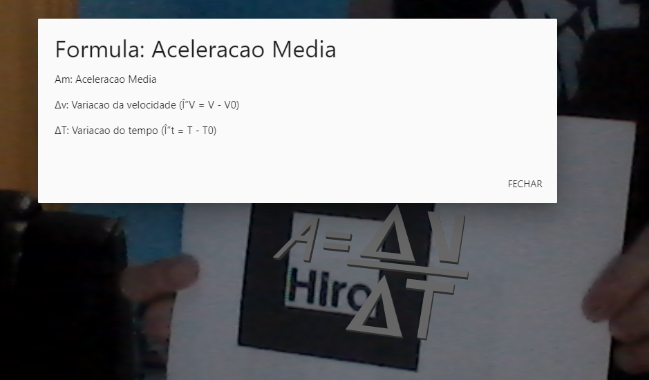

## Overview

Projeto utilizando AR.JS para fornecer uma forma mais interativa de aprendizado para a área matemática focado primeiramente em formulas de fisica basica.

To o projeto foi contruido usando o padrão MVC utilizando Java no backend e Javascript no lado cliente da aplicação.

Exemplos do aplicação em funcionamento:

